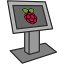

# raspi-kiosk



Ansible playbook to turn your _Raspberry Pi_ into a **web kiosk** (i.e. a device whose sole purpose is to display a web page and consent minimal user interaction). This can sometimes be useful e.g. to display information on a large screen or something.

:information_source: To make the system as lightweight as possible, only **Xorg** and a full-screen **Chromium** browser instance are started. **No window manager** needed! :slightly_smiling_face:

The web page URL is customizable by editing the :page_facing_up: [`.xinitrc`](.xinitrc) file.

## Deployment

Make sure:

- you have **Ansible** installed on your control host (e.g. your laptop)
- your **Raspberry Pi** device is on and reachable by **SSH** from your control host
- you have customized the :page_facing_up: [`hosts.yml`](hosts.yml) file with the right details to connect to your **Raspberry Pi** (host, port, user, password)

Then run the following command:

```bash
ansible-playbook -i hosts.yml playbook.yml
```
